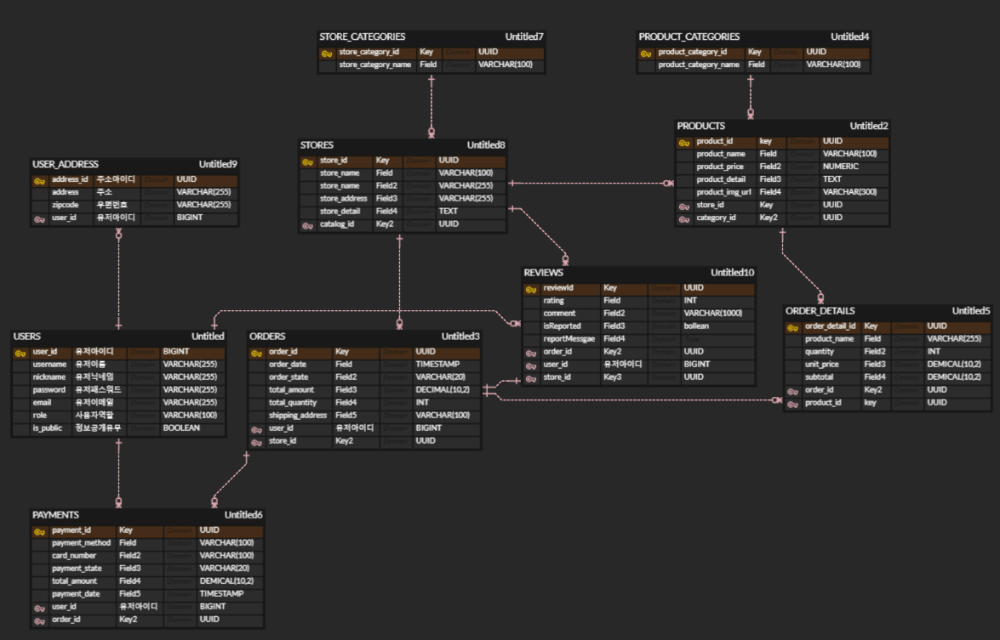
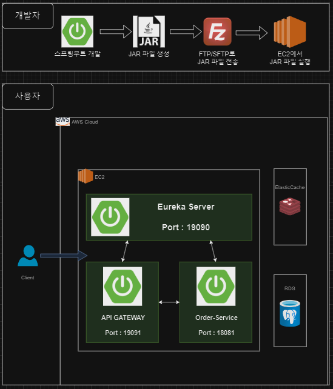

# 🛒  배달핑 (delivery-ping)


## 🔍 프로젝트 목적 (Purpose)

**온라인 주문 및 리뷰 관리 시스템** 프로젝트의 주요 목적은 사용자와 가게 주인 모두에게 효율적이고 만족스러운 경험을 제공하는 것입니다.

1. **효율적인 주문 관리**: 사용자가 다양한 가게의 메뉴를 쉽게 탐색하고 주문할 수 있도록 하여, 사용자 경험을 향상시키고 편리성을 극대화합니다.
2. **투명한 피드백 시스템**: 고객이 주문한 상품에 대한 리뷰를 남기고 평가할 수 있는 시스템을 제공하여, 가게 주인이 고객의 피드백을 적극적으로 수용하고 개선할 수 있는 기회를 제공합니다.
3. **다양한 관리 기능 제공**: 가게 주인은 가게 정보, 상품, 카테고리 등을 쉽게 관리할 수 있으며, 관리자는 전체 시스템을 모니터링하고 유지 관리할 수 있습니다.
4. **실시간 데이터 처리**: 주문 상태, 리뷰 업데이트 등과 같은 실시간 데이터를 처리하여, 사용자와 가게 주인 간의 원활한 소통을 지원합니다.

이를 통해 **가게 주인**은 매출을 증가시키고, **고객**은 더 나은 쇼핑 경험을 누리며, **관리자**는 시스템의 효율적 운영을 보장할 수 있습니다.

## 📋 프로젝트 상세 (Details)

프로젝트는 다음과 같은 기능을 제공합니다:

- 🔐 **회원가입 및 로그인**: 사용자, 가게 주인, 관리자 각각의 권한에 따라 서비스 접근이 가능합니다.
- 🏪 **가게 관리**: 가게 주인은 자신의 가게 정보를 등록, 수정할 수 있으며, 고객은 다양한 가게 정보를 탐색할 수 있습니다.
- 📦 **상품 관리**: 가게 주인은 상품을 등록하고, 수정하며, 삭제할 수 있습니다.
- 🗂️ **카테고리 관리**: 가게 주인은 상품을 관리하기 위해 새로운 카테고리를 추가하거나 기존 카테고리를 수정할 수 있습니다.
- 🛒 **주문 관리**: 사용자는 상품을 장바구니에 추가하고, 주문을 완료할 수 있습니다.
- 📝 **리뷰 작성 및 관리**: 사용자는 주문한 상품에 대해 리뷰를 작성하고, 리뷰를 신고할 수 있습니다.
- ⭐ **평점 계산 및 캐싱**: 가게의 평균 평점을 계산하여 캐시에 저장하고, 효율적으로 조회할 수 있습니다.
- 🛠️ **관리자 기능**: 관리자 권한으로 관리자에게 주요한 정보를 얻을 수 있습니다.
- 🔍 **검색 기능**: 사용자는 다양한 검색 조건과 필터를 적용하여 원하는 가게나 상품을 쉽게 찾을 수 있습니다.

## 👩🏼‍🤝‍👩🏼 팀원 역할분담 (Team Members and Roles)

| 이름        | 역할     | 담당 업무                                          |
|-----------|--------|------------------------------------------------|
| 김유연       | 백엔드 개발 | 사용자 인증, 유저 도메인, MSA 분리                         |
| 권민주       | 백엔드 개발 | 상품, 가게, 카테고리(상품, 가게) 도메인, 호스팅                  |
| 전석배       | 백엔드 개발 | 장바구니, 주문, 결제, 리뷰  도메인 , RDS / Elastic Cache 구축 |


<table>
    <tbody>
        <tr>
            <td align="center"><a href="https://github.com/yooyouny"><br /><sub><b> 김유연 </b></sub></a><br /></td>
            <td align="center"><a href="https://github.com/chrysan5"><br /><sub><b> 권민주 </b></sub></a><br /></td>
            <td align="center"><a href="https://github.com/SerenityZenDev"><br /><sub><b> 전석배 </b></sub></a><br /></td>
    </tr>
    </tbody>
</table>

## 📄 서비스 구성 및 실행방법 (Service Configuration and How to Run)

### 필수 설치 사항 (Prerequisites)

- Java 17.x : Spring Boot 애플리케이션을 실행하기 위한 JDK
- Docker : 애플리케이션을 컨테이너로 실행하기 위한 Docker
  - PostgreSQL 16.x : 백엔드 데이터베이스로 사용할 PostgreSQL 서버
  - Redis 7.4.0 : 캐싱을 위한 인메모리 데이터베이스로 사용될 Redis 서버

### 설치 및 실행 방법 (Installation and Running)
1. 데이터베이스 컨테이너 실행 (PostgreSQL)
```bash
docker run --name my-postgres -e POSTGRES_PASSWORD=mysecretpassword -d -p 5432:5432 postgres:latest
```
2. Redis 컨테이너 실행
```bash
docker run --name redis -d -p 6379:6379 redis:latest
```
3. 리포지토리 클론
```bash
git clone https://github.com/BAEDALPING/eureka-server.git
git clone https://github.com/BAEDALPING/gateway-server.git
git clone https://github.com/BAEDALPING/order-service.git
```
4. Eureka Server 실행
```bash
cd eureka-server
./gradlew clean build  # 프로젝트 빌드
./gradlew bootRun      # Eureka Server 실행
```
5. Gateway Server yml 설정 후 실행
- appication.yml 수정
  - src/main/java/com.baedalping.gateway/resources/appication.yml
  - ${JWT_SECRET} 값 설정 (Order-Service 프로젝트와 같은 값 사용)
```bash
cd gateway-server
./gradlew clean build  # 프로젝트 빌드
./gradlew bootRun      # Gateway Server 실행
```

6. Order Server yml 설정 후 실행
- appication.yml 수정
  - spring.datasource.url=jdbc:postgresql://localhost:5432/your_database_name
  - spring.datasource.username=postgres
  - spring.datasource.password=mysecretpassword
  - ${JWT_SECRET} 값 설정 (Gateway 프로젝트와 같은 값 사용)
```
cd order-service
./gradlew clean build  # 프로젝트 빌드
./gradlew bootRun      # Order Service 실행
```

## 📚 ERD 다이어그램


## ⚙ 기술 스택
-  : 주 언어로 사용되었습니다.
-  : 프로젝트의 백엔드 개발에 사용되었습니다
- -  : 프로젝트의 메인 프레임워크로 사용되었습니다.
- -  : 보안 기능을 구현하는 데 사용되었습니다.
- -  : 클라우드 환경에서의 마이크로서비스 아키텍처를 구현하는 데 사용되었습니다.
-  : 데이터베이스 ORM(Object-Relational Mapping) 프레임워크로 사용되었습니다.
-  : 관계형 데이터베이스 서비스로 사용되었습니다.
-  : 관계형 데이터베이스로 사용되었습니다.
-  : 캐싱 서비스로 사용되었습니다.
-  : 캐싱 사용을 위해 사용되었습니다.
-  : 애플리케이션의 서버 호스팅에 사용되었습니다.

## 🔥 아키텍쳐


## ✍️ API Design

Request/Response

-----

Request

 - HTTP method + URL path

 - With authorization in header : Bearer {accessToken}

 - body : JSON
```json
{
   key: value
}
```

---

Response

- Status code
- body : JSON

성공
```json
{
  "status" : "CREATED/OK",
  "message" : "",
  "data" : {
    key : value
  }
}
```

실패
```json
{
  "status" : "",
  "message" : "",
  "data" : null
}
```

USERS (유저)

- 회원정보 읽기 : GET /users (USER)
- 회원정보 수정 : PUT /users (USER)
- 회원탈퇴 : DELETE /users (USER)
- 회원 배송지 등록 : POST /users/address (USER)
- 회원 배송지 수정 : PUT /users/address/{addressId} (USER)
- 회원 배송지 목록 조회 : GET /users/address (USER)

AUTH (인증)
- 회원가입 : POST /auth (ALL)
- 로그인 : POST /auth/login (ALL)

ORDERS (주문)
- 주문 생성 : POST /orders (OWNER, USER)
- 가게 주문 조회 : GET /owner/orders/stores/{storeId} (ADMIN, OWNER)
- 개인 주문 조회 : GET /orders/users (ADMIN, OWNER, USER)
- 주문 키워드 검색 : GET /orders/search?keyword= (ADMIN, OWNER, USER)
- 주문 단건 상세 조회 : GET /orders/{orderId} (ADMIN, OWNER, USER)
- 주문 취소 : DELETE /orders/{orderId}/cancel (ADMIN, OWNER, USER)

PAYMENTS (결제)
- 결제 생성 : POST /orders/{orderId}/payments (USER)
- 본인 결제 내역 전체 조회 : GET /payments (USER)
- 결제 내역 상세 조회 : GET /payments/{paymentId} (USER)
- 결제 취소 : DELETE /payments/{paymentId} (ADMIN, USER)

CART (장바구니)
- 장바구니 추가 : POST /carts/add (USER)
- 장바구니 조회 : GET /carts (USER)
- 장바구니 수량 변경 : PATCH /carts/update (USER)
- 장바구니 비우기 : DELETE /carts/clear (USER)

ADMIN (관리자)
- 회원 탈퇴 : DELETE /admin/users/{userId} (ADMIN)
- 회원 목록 조회 : GET /admin/users (ADMIN)
- 권한 변경하기 : PUT /admin/{userId}/role (ADMIN)
- 가게 주문 조회 : GET /owner/orders/stores/{storeId} (ADMIN, OWNER)
- 가게 리뷰 조회 (신고 내역 포함) : GET /owner/reviews (ADMIN, OWNER)

PRODUCT_CATEGORIES (상품 분류)
- 상품 분류 전체 조회 : GET /productCategories (ALL)
- 상품 분류 추가 : POST /productCategories (ADMIN)
- 상품 분류 수정 : PUT /productCategories/{productCategoryId} (ADMIN)
- 상품 분류 삭제 : DELETE /productCategories/{productCategoryId} (ADMIN, OWNER)

PRODUCTS (상품)
- 상품 전체 조회 : GET /products (ADMIN, OWNER, USER)
- 상품 단일 조회 : GET /products/{productId} (ADMIN, OWNER, USER)
- 상품 생성 : POST /products (OWNER)
- 상품 수정 : PUT /products/{productId} (OWNER)
- 상품 삭제 : DELETE /products/{productId} (OWNER)
- 상품 검색 : GET /products/search?keyword= (ALL)

STORES (가게)
- 가게별 상품 목록 조회 : GET /stores/{storeId}/products (ALL)
- 가게 생성 : POST /stores (OWNER)
- 가게 수정 : PUT /stores/{storeId} (OWNER)
- 가게 삭제 : DELETE /stores/{storeId} (ADMIN, OWNER)
- 가게 단일 조회 : GET /stores/{storeId} (ALL)
- 가게 전체 조회 : GET /stores (ALL)
- 가게 생성 승인 : PUT /admin/stores/{storeId}/permit (ADMIN)
- 가게 검색 : GET /stores/search?keyword= (ALL)

STORE_CATEGORIES (가게 분류)
- 가게 분류별 가게 조회 : GET /storeCategories/{storeCategoryId} (ALL)
- 가게 분류 생성 : POST /storeCategories (ADMIN)
- 가게 분류 수정 : PUT /storeCategories/{storeCategoryId} (ADMIN)
- 가게 분류 삭제 : DELETE /storeCategories/{storeCategoryId} (ADMIN)
- 가게 분류 전체 조회 : GET /storeCategories (ALL)

REVIEWS (리뷰)
- 리뷰 생성 : POST /reviews (USER)
- 가게 리뷰 조회 : GET /reviews/{storeId} (ALL)
- 리뷰 신고 : PATCH /reviews/{reviewId}/report (USER)
- 리뷰 가게 평점 계산 : GET /reviews/store/{storeId}/average-rating (ALL)


